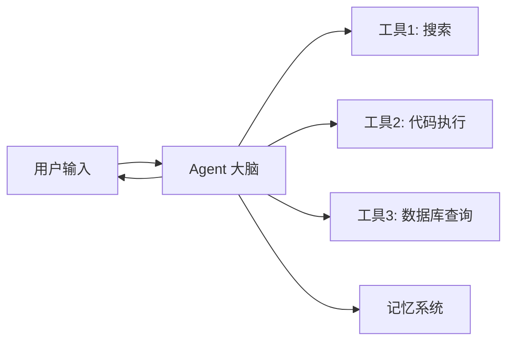
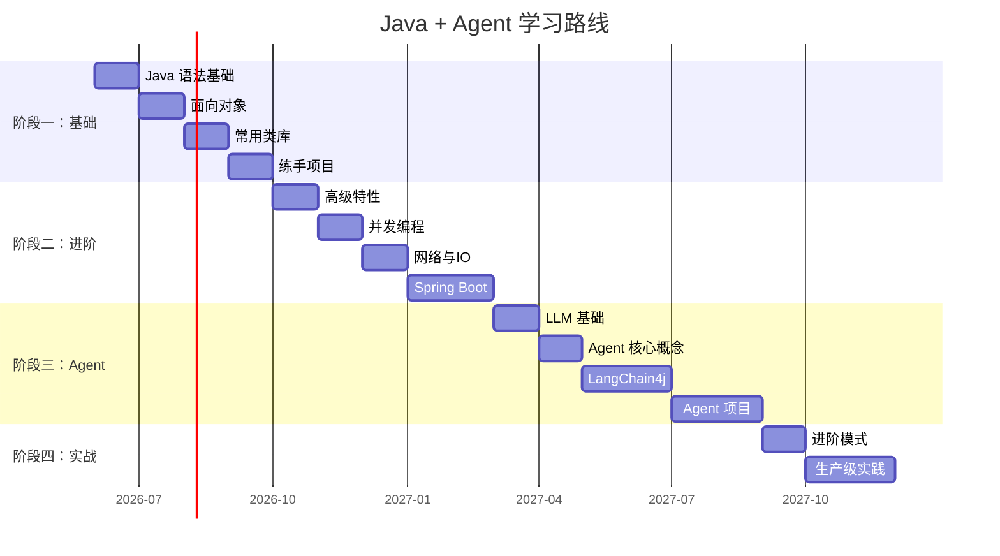

# Java + Agent 学习路线

> [!abstract] 路线概述
> 大一从现在开始，分四个阶段。Java 基础 → Java 进阶 → Agent 理论与框架 → 实战项目。预计持续 1.5~2 年，到大二下具备独立开发 Agent 应用的能力。

---

## 阶段一：Java 基础（大一上 ~ 大一下，3~4 个月）

> [!important] 核心目标
> 能独立写出千行级别的命令行小应用。掌握面向对象思维。

### 1.1 语法基础 (2~3 周)

- 环境搭建：JDK 21+、IDEA
- 基本类型、运算符、控制流
- 数组与字符串
- 方法定义与调用

```java
// 一周内能写出这个水平即可
public class Calculator {
    public static double calculate(double a, double b, char op) {
        return switch (op) {
            case '+' -> a + b;
            case '-' -> a - b;
            case '*' -> a * b;
            case '/' -> a / b;
            default -> throw new IllegalArgumentException("未知运算符: " + op);
        };
    }
}
```

### 1.2 面向对象 (3~4 周)

- 类与对象、构造方法
- 封装：`private` / `public` / 包级访问
- 继承与 `super`
- 多态：接口 `interface` vs 抽象类 `abstract class`
- `static` / `final` 关键字

> [!tip] 关键检验
> 能说清楚：**"为什么 `List<String> list = new ArrayList<>()` 要左边写接口？"** —— 说不清楚说明多态没吃透。

### 1.3 常用类库 (2~3 周)

- `java.util.*`：`List` / `Set` / `Map` / `Queue`
- `java.time.*`：日期时间处理
- `java.io.*`：文件读写
- 异常处理：checked vs unchecked

### 1.4 练手项目（必做）

> [!example] 阶段一项目
> - **学生管理系统**（控制台）：增删改查 + 文件持久化
> - **简易 Todo 应用**：支持标签、优先级、截止日期

---

## 阶段二：Java 进阶（大一下 ~ 大二上，3~4 个月）

> [!important] 核心目标
> 掌握现代 Java 工程化开发。能写 Spring Boot 后端。

### 2.1 构建与工程化 (1 周)

- Maven：`pom.xml`、依赖管理、插件
- 项目目录规范
- Git 基本操作

### 2.2 高级特性 (3~4 周)

| 主题 | 要点 |
|------|------|
| 泛型 | 类型擦除、通配符 `? extends` / `? super` |
| 注解 | 内置注解 + 自定义注解 |
| 反射 | `Class`、`Method`、`Field` |
| Lambda & Stream | `map` / `filter` / `reduce` / `collect` |
| Optional | 防空利器 |

> [!warning] 不要跳过反射
> Agent 框架大量使用反射和动态代理。看不懂 `@Tool` 注解怎么生效的，就是在黑盒开发。

### 2.3 并发编程 (3~4 周)

- 线程创建：`Thread` / `Runnable` / `Callable`
- 线程池：`Executors` / `ThreadPoolExecutor`
- 同步：`synchronized` / `ReentrantLock`
- 并发集合：`ConcurrentHashMap`
- `CompletableFuture`：异步编排 ← **Agent 并发调工具的核心**

### 2.4 网络与 IO (2 周)

- BIO / NIO 概念
- HTTP 协议基础
- `HttpClient`（Java 11+ 内置）
- JSON 序列化：Jackson / Gson

### 2.5 Spring Boot 入门 (3~4 周)

- IoC / DI 容器原理
- `@RestController` / `@Service` / `@Repository`
- RESTful API 设计
- Spring Boot Starter
- 配置文件 `application.yml`

> [!example] 阶段二项目
> - **RESTful API 服务**：Todo 应用的 Web 版
> - **文件上传下载服务**：含并发控制
> - **简单爬虫**：`HttpClient` + Jsoup 抓取网页

---

## 阶段三：Agent 理论与框架（大二上，3~4 个月）

> [!important] 核心目标
> 理解 LLM 原理、Agent 架构，能用 LangChain4j / Spring AI 搭出有记忆+会调工具的 Agent。

### 3.1 LLM 基础概念 (1~2 周)

- Transformer 架构概要（不需要手写，懂结构即可）
- Prompt Engineering：System Prompt / Few-shot / CoT
- Token 与上下文窗口
- Embedding 与向量检索原理

> [!tip] 推荐资源
> - DeepLearning.AI 的 ChatGPT Prompt Engineering 课程（免费）
> - 李宏毅 2024 Transformer 课程

### 3.2 Agent 核心概念 (2~3 周)



| 概念 | 说明 |
|------|------|
| **Agent** | LLM + 工具 + 记忆 + 规划 |
| **Tool Calling** | Agent 自主决定调用哪个工具、传什么参数 |
| **Memory** | 短期（对话上下文）/ 长期（向量库） |
| **RAG** | 检索增强生成——先查知识库再回答 |
| **ReAct** | 思考→行动→观察→思考 的循环模式 |
| **Multi-Agent** | 多个 Agent 协作 / 竞争 |

### 3.3 Java Agent 框架 (4~5 周)

#### LangChain4j（推荐首选）

```java
// 最简单的 Agent 示例
ChatLanguageModel model = OpenAiChatModel.builder()
    .apiKey(System.getenv("OPENAI_API_KEY"))
    .modelName("gpt-4o")
    .build();

AiServices.builder(Assistant.class)
    .chatLanguageModel(model)
    .tools(new Calculator())  // 注册工具
    .build();
```

核心模块：
- `chat-language-model`：对接各种 LLM
- `tools`：`@Tool` 注解定义工具
- `embedding-store`：向量存储（Redis / Milvus / PgVector）
- `document-parser`：PDF / Word 解析
- `ai-services`：声明式 Agent 接口

#### Spring AI

- 与 Spring 生态深度整合
- `ChatClient`、`Advisor`、`FunctionCallback`
- ETL 流程：Document → Split → Embed → Store

> [!note] 两个框架怎么选？
> - **LangChain4j**：框架无关，接口设计更优雅，社区活跃。推荐新手。
> - **Spring AI**：如果你已经会用 Spring Boot，上手更快。生产项目更友好。

### 3.4 配套技能 (2~3 周)

- **Docker**：跑向量数据库（Milvus / Qdrant）、Redis
- **Prompt 设计**：模板化、变量注入、安全过滤
- **Function Calling 协议**：OpenAI / Anthropic 格式差异

> [!example] 阶段三项目
> - **智能客服 Bot**：RAG + 产品文档 → 回答用户问题
> - **个人知识库问答**：把自己的 Obsidian 笔记喂给 Agent
> - **SQL 自然语言查询**：Agent 把自然语言转 SQL 并执行

---

## 阶段四：实战深水区（大二下+，持续）

> [!important] 核心目标
> 能独立设计 Agent 系统架构。能评估和优化 Agent 表现。

### 4.1 进阶 Agent 模式

| 模式 | 说明 |
|------|------|
| **Router Agent** | 根据意图路由到不同的子 Agent |
| **Plan-and-Execute** | 先制定计划，再逐步执行 |
| **Reflection** | Agent 自我评估输出质量并修正 |
| **Multi-Agent 编排** | Supervisor / Debate / Swarm 模式 |
| **Human-in-the-Loop** | 关键操作需要人工审批 |

### 4.2 生产级关注点

- **可观测性**：Langfuse / LangSmith 追踪 Agent 调用链
- **安全**：Prompt Injection 防御、工具调用权限控制
- **评估**：RAGAS 评估检索质量、Agent Benchmark
- **成本控制**：Token 用量监控、缓存策略
- **流式输出**：SSE / WebSocket 实现打字机效果

### 4.3 技术栈拓展

- **多模态**：GPT-4o Vision / DALL-E
- **本地模型**：Ollama + Qwen / Llama
- **MCP 协议**：Anthropic 的 Model Context Protocol
- **GraphRAG**：知识图谱增强检索

> [!example] 阶段四项目
> - **代码审查 Agent**：自动 Review Git Diff 并评论
> - **多 Agent 协作写报告**：一个拆大纲、一个写各段、一个审核
> - **个人助理 Agent**：日历 + 邮件 + 笔记 联动

---

## 踩坑建议

> [!bug] 常见坑
> 1. **跳过 Java 基础直接搞 Agent** → 框架报错都不知道怎么查
> 2. **只调 API 不看原理** → 遇到非理想输出束手无策
> 3. **只学一个模型** → OpenAI 涨价/封号会直接瘫痪
> 4. **不学并发** → Agent 并行走工具调用核心就是 `CompletableFuture`
> 5. **忽视评估** → 系统好不好完全凭感觉

> [!success] 好习惯
> - 每个阶段做至少一个完整项目，代码放 GitHub
> - 用 Obsidian 做笔记，形成自己的知识网络
> - 每周看一篇 AI/Agent 领域的技术博客
> - 加入开源社区：LangChain4j 的 good first issue

---

## 推荐资源

### 书籍
- 《On Java 8》—— Bruce Eckel 的 Java 进阶神作
- 《Java 并发编程实战》—— 并发圣经
- 《Building LLM Apps》—— LLM 应用开发入门

### 在线
- [LangChain4j 官方文档](https://docs.langchain4j.dev/)
- [Spring AI 参考文档](https://docs.spring.io/spring-ai/reference/)
- [DeepLearning.AI Short Courses](https://www.deeplearning.ai/short-courses/)
- [B站：刘森的技术分享——LLM 应用开发]()

### 论文（阶段四看）
- ReAct: Synergizing Reasoning and Acting in Language Models
- Toolformer: Language Models Can Teach Themselves to Use Tools
- AutoGen: Enabling Next-Gen LLM Applications via Multi-Agent Conversation

---

## 路线总览



---

> [!quote] 一句话总结
> Java 是地基，Agent 是楼。地基不深楼会塌。大一先把 Java 基础打扎实，别急着追热点。
